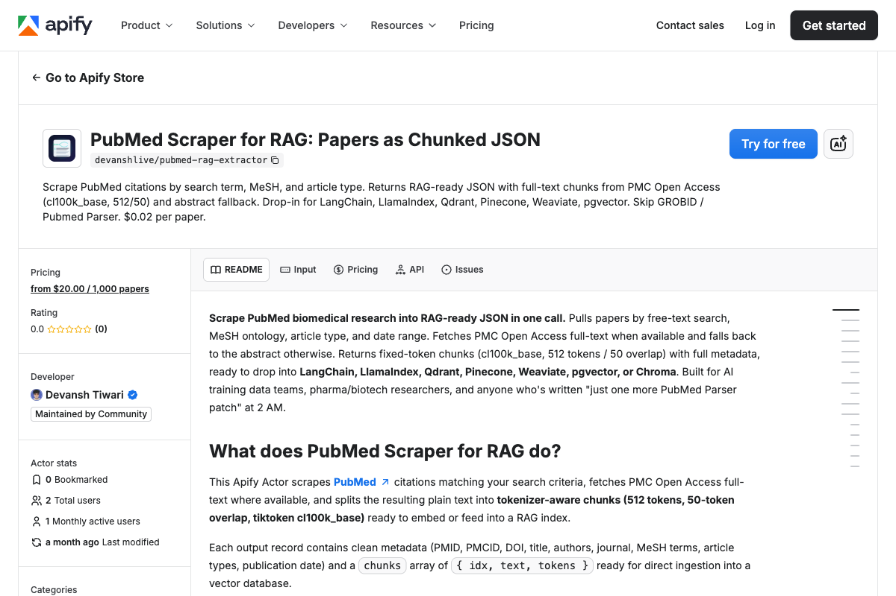

<div align="center">

# PubMed Scraper | Medical Literature Data Extraction API | Apify Actor

[](https://apify.com/devanshlive/pubmed-rag-extractor)
[](https://nodejs.org/)
[](https://github.com/getascraper)
[](https://github.com/getascraper/how-to-scrape-pubmed)

**PubMed scraper and medical literature data extraction API. Extract papers, abstracts, and citations from PubMed with this Apify actor. Free tier included.**

Built for biomedical researchers, pharma analysts, and AI developers who need clean, structured clinical literature without XML parsing.

[Quick Start](#quick-start) · [API Reference](#api-reference) · [Pricing](#pricing) · [Support](#support)



</div>

---

## Quick Start

```javascript
import { ApifyClient } from 'apify-client';
import 'dotenv/config';

const client = new ApifyClient({ token: process.env.APIFY_TOKEN });

const run = await client.actor('devanshlive/pubmed-rag-extractor').call({
  searchTerm: 'SARS-CoV-2 vaccines',
  articleTypes: ['review', 'meta_analysis'],
  dateFrom: '2024-01-01',
  dateTo: '2024-01-31',
  maxPapers: 10,
});

const { items } = await client.dataset(run.defaultDatasetId).listItems();
console.log(items);
```

**Output:**
```json
{
  "pmid": "38212345",
  "pmcid": "PMC10812345",
  "doi": "10.1000/example",
  "title": "mRNA Vaccines: A New Era in Immunology",
  "abstract": "Messenger RNA vaccines represent a breakthrough...",
  "authors": ["Smith J", "Doe A"],
  "journal": "Nature Medicine",
  "mesh_terms": ["mRNA Vaccines", "COVID-19"],
  "article_types": ["review", "meta_analysis"],
  "publication_date": "2024-01-15",
  "pubmed_url": "https://pubmed.ncbi.nlm.nih.gov/38212345",
  "pdf_url": "https://pmc.ncbi.nlm.nih.gov/articles/PMC10812345/pdf",
  "source": "full_text",
  "chunks": [
    {
      "idx": 0,
      "text": "The development of mRNA vaccines...",
      "tokens": 512
    }
  ]
}
```

---

## Features

- **PMC full-text extraction** when Open Access is available
- **Abstract fallback** for non-OA papers
- **MeSH term indexing** for structured biomedical tagging
- **cl100k_base tokenization** with 512 tokens per chunk
- **Drop-in for vector databases** ready for LangChain, LlamaIndex, Qdrant

---

## What this actor does

This Actor extracts PubMed papers by search term, MeSH terms, article types, and date range. It prioritizes full-text extraction from PMC Open Access when available, falling back to abstracts for non-OA papers.

It supports structured biomedical queries with MeSH descriptors, article type filtering, and date range selection. Each paper includes bibliographic metadata and token-aware chunks.

---

## Installation

```bash
npm install
```

Copy the environment file and add your Apify API token:

```bash
cp .env.example .env
```

Open `.env` and replace `your_apify_token_here` with your actual Apify API token. Get one free at [console.apify.com](https://console.apify.com/settings/integrations).

---

## Input

| Field | Type | Description | Default |
|-------|------|-------------|---------|
| `searchTerm` | string | Search query (e.g. `SARS-CoV-2 vaccines`) | none |
| `meshTerms` | array | MeSH Descriptor headings | none |
| `articleTypes` | array | `review`, `meta_analysis`, `clinical_trial` | none |
| `dateFrom` | string | Start date (YYYY-MM-DD) | none |
| `dateTo` | string | End date (YYYY-MM-DD) | none |
| `maxPapers` | integer | Max papers to extract | 100 |

---

## Output

Each paper is a structured JSON record with token-aware chunks. Download as JSON, CSV, Excel, or HTML.

| Field | Description |
|-------|-------------|
| `pmid` | PubMed ID (primary identifier) |
| `pmcid` | PubMed Central ID (present for PMC OA papers) |
| `doi` | DOI (when provided) |
| `title` | Paper title |
| `abstract` | Abstract as returned by E-utilities |
| `authors` | Author display names, order preserved |
| `journal` | Journal title |
| `mesh_terms` | MeSH Descriptor headings assigned by NLM |
| `article_types` | PubMed publication types |
| `publication_date` | YYYY-MM-DD |
| `pubmed_url` | Link to the PubMed citation |
| `pdf_url` | PMC PDF link, when available |
| `source` | `full_text` or `abstract` (text origin) |
| `chunks` | Token-aware chunks for RAG |
| `chunks[].idx` | 0-indexed position |
| `chunks[].text` | Chunk text |
| `chunks[].tokens` | Token count (≤ 512) |

See `sample-output.json` for a full example.

---

## Pricing

**$0.02 per paper.**

A run of 100 papers typically completes in 1 to 2 minutes. Pay only for what you extract.

---

## Use Cases

- **Biomedical research:** Build RAG corpora from PubMed without XML parsing
- **Clinical evidence:** Extract systematic reviews and meta-analyses for evidence synthesis
- **Pharma intelligence:** Monitor drug-related publications for competitive analysis
- **Embedding pipelines:** Feed pre-chunked text into vector databases for biomedical Q&A

---

## FAQ

**What article types can I filter by?**
`review`, `meta_analysis`, `clinical_trial`, `randomized_controlled_trial`, `observational_study`, and more.

**How does full-text vs abstract work?**
The Actor first attempts to extract full text from PMC Open Access. If the paper is not OA, it falls back to the abstract.

**Do I need MeSH terms?**
No. MeSH terms are optional. You can search by free-text query alone.

---

## Support

Open an issue in the [Apify Console](https://console.apify.com/actors/devanshlive~pubmed-rag-extractor/issues).

---

## Related Resources

- [PubMed E-utilities documentation](https://www.ncbi.nlm.nih.gov/books/NBK25501/)
- [Apify Client for JavaScript](https://docs.apify.com/api/client/js/)

---

**Ready to start extracting?**

[Open the PubMed Scraper for RAG on Apify](https://apify.com/devanshlive/pubmed-rag-extractor)
